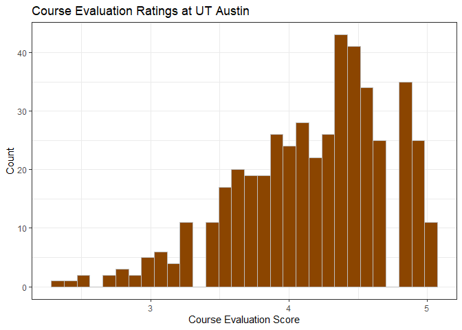
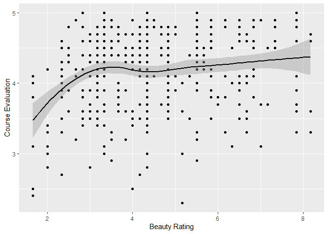
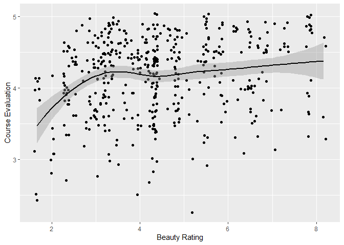
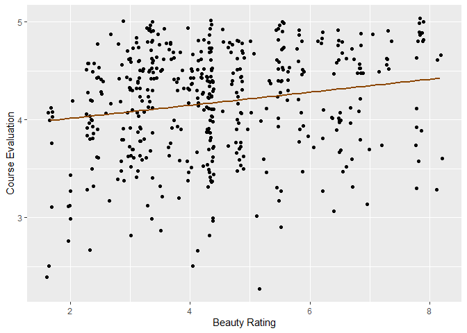

Lab 09 - Grading the professor, Pt. 1
================
Ryan Wheat
Insert date here

### Load packages and data

``` r
library(tidyverse) 
```

    ## Warning: package 'tidyverse' was built under R version 4.2.3

    ## Warning: package 'ggplot2' was built under R version 4.2.3

    ## Warning: package 'tidyr' was built under R version 4.2.3

    ## Warning: package 'readr' was built under R version 4.2.3

    ## Warning: package 'forcats' was built under R version 4.2.3

    ## Warning: package 'lubridate' was built under R version 4.2.3

``` r
library(tidymodels)
```

    ## Warning: package 'tidymodels' was built under R version 4.2.3

    ## Warning: package 'broom' was built under R version 4.2.3

    ## Warning: package 'dials' was built under R version 4.2.3

    ## Warning: package 'infer' was built under R version 4.2.3

    ## Warning: package 'modeldata' was built under R version 4.2.3

    ## Warning: package 'parsnip' was built under R version 4.2.3

    ## Warning: package 'recipes' was built under R version 4.2.3

    ## Warning: package 'rsample' was built under R version 4.2.3

    ## Warning: package 'tune' was built under R version 4.2.3

    ## Warning: package 'workflows' was built under R version 4.2.3

    ## Warning: package 'workflowsets' was built under R version 4.2.3

    ## Warning: package 'yardstick' was built under R version 4.2.3

``` r
library(openintro)
```

    ## Warning: package 'openintro' was built under R version 4.2.3

    ## Warning: package 'airports' was built under R version 4.2.3

    ## Warning: package 'cherryblossom' was built under R version 4.2.3

    ## Warning: package 'usdata' was built under R version 4.2.3

### Exercise 1

This distribution looks negatively skewed. This indicates that students
generally give positive course evaluations, creating a bit of ceiling
effect. This is what I expected to see: if professors are getting hired
at UT Austin, chances are that they’re decent at their job. However,
just based on probabilities, chances are good that a few of them aren’t
so great at teaching…

``` r
ggplot(data = evals, mapping = aes(x = score)) + geom_histogram(color = "grey", fill = "darkorange4") + labs(x = "Course Evaluation Score", y = "Count", title = "Course Evaluation Ratings at UT Austin") + theme_bw()
```

    ## `stat_bin()` using `bins = 30`. Pick better value with `binwidth`.

<!-- -->

### Exercise 2

There seems to be a positive relationship between a professor’s beauty
and their course evaluation; the more beautiful a lecturer is, the more
likely they will receive favorable course evaluations from students.

``` r
ggplot(data = evals, mapping = aes(x = bty_avg, y = score)) + geom_point() + geom_smooth(color = "black") + labs(x = "Beauty Rating", y = "Course Evaluation")
```

    ## `geom_smooth()` using method = 'loess' and formula = 'y ~ x'

<!-- -->

``` r
cor(evals$bty_avg, evals$score)
```

    ## [1] 0.1871424

### Exercise 3

This is a better visualization of the relationship between beauty and
evaluation score, because it allows one to see where the data are
clustered. In the previous scatterplot, the data look evenly dispersed
in a way that does not match the histogram from Exercise 1 (where
evaluation scores are clustered around 4), and might make it seem like
there is a different distribution of scores than there is. Here, that
better matches what we already know and have found.

``` r
ggplot(data = evals, mapping = aes(x = bty_avg, y = score)) + geom_jitter() + geom_smooth(color = "black") + labs(x = "Beauty Rating", y = "Course Evaluation")
```

    ## `geom_smooth()` using method = 'loess' and formula = 'y ~ x'

<!-- -->

### Exercise 4

score = bty_avg(.066) + 3.88

``` r
first_model = lm(score ~ bty_avg, data = evals)
summary(first_model)
```

    ## 
    ## Call:
    ## lm(formula = score ~ bty_avg, data = evals)
    ## 
    ## Residuals:
    ##     Min      1Q  Median      3Q     Max 
    ## -1.9246 -0.3690  0.1420  0.3977  0.9309 
    ## 
    ## Coefficients:
    ##             Estimate Std. Error t value Pr(>|t|)    
    ## (Intercept)  3.88034    0.07614   50.96  < 2e-16 ***
    ## bty_avg      0.06664    0.01629    4.09 5.08e-05 ***
    ## ---
    ## Signif. codes:  0 '***' 0.001 '**' 0.01 '*' 0.05 '.' 0.1 ' ' 1
    ## 
    ## Residual standard error: 0.5348 on 461 degrees of freedom
    ## Multiple R-squared:  0.03502,    Adjusted R-squared:  0.03293 
    ## F-statistic: 16.73 on 1 and 461 DF,  p-value: 5.083e-05

### Exercise 5

``` r
ggplot(data = evals, mapping = aes(x = bty_avg, y = score)) + geom_jitter() + geom_smooth(method = lm, color = "darkorange4", se = FALSE) + labs(x = "Beauty Rating", y = "Course Evaluation")
```

    ## `geom_smooth()` using formula = 'y ~ x'

<!-- -->

### Exercise 6

Slope Interpretation: a one-unit increase in beauty rating is associated
with a .066 unit increase in a professor’s course evlauations.

### Exercise 7

Intercept Interpretation: a professor with a beauty rating of 0 would
have a course evaluation score of 3.88. In this case, the intercept
doesn’t make a ton of sense because it’s impossible to have a beauty
rating of 0. You have to have at least some appearance!

### Exercise 8

R2 = .035

3.5% of the variance in course evaluation scores is explained by a
professor’s beauty.

### Exercise 9

score = gender(.14) + 4.09

Slope Interpretation: male professors receive course evaluations that,
on average, are .14 units higher than female professors.

Intercept: the average female professor receives a course evaluation of
4.09.

``` r
m_gen = lm(score ~ gender, data = evals)
summary(m_gen)
```

    ## 
    ## Call:
    ## lm(formula = score ~ gender, data = evals)
    ## 
    ## Residuals:
    ##      Min       1Q   Median       3Q      Max 
    ## -1.83433 -0.36357  0.06567  0.40718  0.90718 
    ## 
    ## Coefficients:
    ##             Estimate Std. Error t value Pr(>|t|)    
    ## (Intercept)  4.09282    0.03867 105.852  < 2e-16 ***
    ## gendermale   0.14151    0.05082   2.784  0.00558 ** 
    ## ---
    ## Signif. codes:  0 '***' 0.001 '**' 0.01 '*' 0.05 '.' 0.1 ' ' 1
    ## 
    ## Residual standard error: 0.5399 on 461 degrees of freedom
    ## Multiple R-squared:  0.01654,    Adjusted R-squared:  0.01441 
    ## F-statistic: 7.753 on 1 and 461 DF,  p-value: 0.005583

### Exercise 10

Male Professor Equation: score = 4.23 Female Professor Equation: score =
4.09

### Exercise 11

score = tenuretrack(-.12) + tenured(-.14) + 4.28

Slope Interpretations: Tenure track professors, on average, receive a
course evaluation of 4.15; tenured professors receive an average
evaluation of 4.13.

Intercept: Teaching professors, on average, receive a course evaluation
of 4.28.

``` r
m_rank = lm(score ~ rank, data = evals)
summary(m_rank)
```

    ## 
    ## Call:
    ## lm(formula = score ~ rank, data = evals)
    ## 
    ## Residuals:
    ##     Min      1Q  Median      3Q     Max 
    ## -1.8546 -0.3391  0.1157  0.4305  0.8609 
    ## 
    ## Coefficients:
    ##                  Estimate Std. Error t value Pr(>|t|)    
    ## (Intercept)       4.28431    0.05365  79.853   <2e-16 ***
    ## ranktenure track -0.12968    0.07482  -1.733   0.0837 .  
    ## ranktenured      -0.14518    0.06355  -2.284   0.0228 *  
    ## ---
    ## Signif. codes:  0 '***' 0.001 '**' 0.01 '*' 0.05 '.' 0.1 ' ' 1
    ## 
    ## Residual standard error: 0.5419 on 460 degrees of freedom
    ## Multiple R-squared:  0.01163,    Adjusted R-squared:  0.007332 
    ## F-statistic: 2.706 on 2 and 460 DF,  p-value: 0.06786

### Exercise 12

``` r
evals <- evals %>%
  mutate(rank_relevel = relevel(evals$rank, ref = "teaching"))
```

### Exercise 13

…

Add exercise headings as needed.

## 

For Exercise 12, relevel() function can be helpful!
